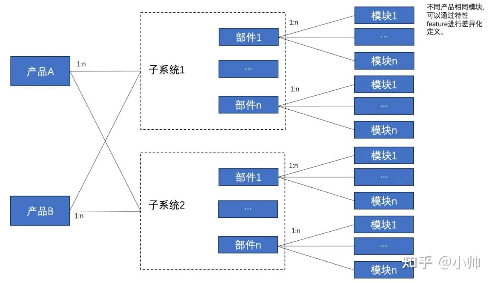
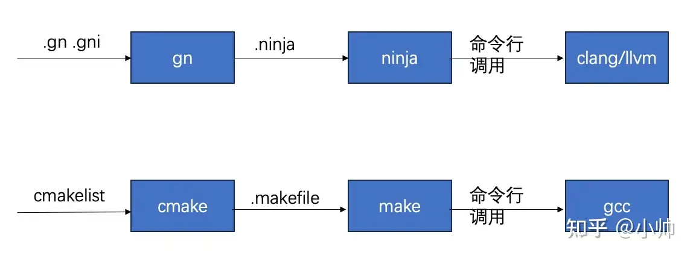
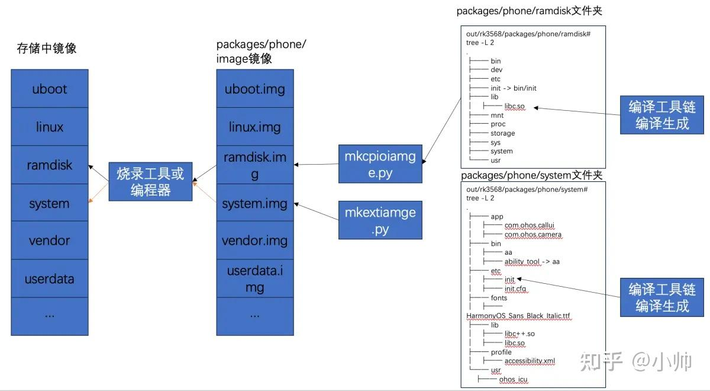

# OpenHarmony开源项目

https://docs.openharmony.cn/pages/v4.1/zh-cn/OpenHarmony-Overview_zh.md/

### 技术架构




### 编译框架

https://zhuanlan.zhihu.com/p/677673372

OpenHarmony 编译框架是基于**模块化**的，从大到小依次划分为*产品、子系统集（或领域）、子系统、部件、模块、特性*

1. **产品（product）**

    产品：由一定的解决方案、基于开发板的完整产品，主要包含产品对OS的适配、部件拼装配置、启动配置和文件系统配置等。

    `build.sh` 编译的时候通过 `--product-name` 编译选项指定开发板；

    ```
    # 适用于标准(即L2或standard)系统编译
    ./build.sh --product-name rk3568 --ccache
    ```

    `hb` 编译的时候通过 `hb set` 进行设置；

    ```
    cd build  # 进入源码下build目录
    hb set    # 执行hb set命令，选择对应的产品名称
    hb build  # 执行hb build命令，进行编译
    ```

2. **子系统集（domain）**

    OpenHarmony 技术架构中有四大子系统集：“系统基本能力子系统集”、“基础软件服务子系统集”、“增强软件服务子系统集”、“硬件服务子系统集”。
    
    四大子系统集不会直接出现在编译选项或者参数中，而是有对应的一级源代码文件夹：“系统基本能力子系统集”对应源码 `foundation` 文件夹；“基础软件服务子系统集”和“硬件服务子系统集”对应源码 `base` 文件夹；“增强软件服务子系统集”对应源码 `domains` 文件夹。

    ```
    .
    ├── applications //应用程序
    ├── arkcompiler  //ark编译器
    ├── base         //“基础软件服务子系统集”和“硬件服务子系统集”
    ├── build        //编译目录
    ├── build.py -> build/lite/build.py //软链接
    ├── build.sh -> build/build_scripts/build.sh //软链接，标准系统编译入口
    ├── commonlibrary  //通用库
    ├── developtools   //开发工具
    ├── device         //芯片相关
    ├── docs           //文档md文件目录
    ├── drivers        //驱动文件
    ├── foundation     //“系统基本能力子系统集”
    ├── ide            //ide
    ├── interface      //接口
    ├── kernel         //内核，liteos-m，liteos-a，linux，uniproton
    ├── napi_generator //native api相关
    ├── prebuilts      //编译工具路径
    ├── productdefine  //产品定义
    ├── qemu-run -> vendor/ohemu/common/qemu-run //qemu模拟器运行脚本
    ├── test           //测试用例
    ├── third_party    //三方库
    └── vendor         //产品
    ```

3. **子系统（subsystem）**

    子系统：是一个逻辑概念，它具体由对应的部件构成。
    
    在多设备部署场景下，支持根据实际需求裁剪某些非必要的子系统或部件。
    
    在 `build/subsystem_config.json` 中定义。

    ```
    {
        "arkui": {
            "path": "foundation/arkui",   //子系统源码路径
            "name": "arkui"               //子系统名称
        },
        "ai": {
            "path": "foundation/ai",
            "name": "ai"
        },
        "distributeddatamgr": {
            "path": "foundation/distributeddatamgr",
            "name": "distributeddatamgr"
        },
        "security": {
            "path": "base/security",
            "name": "security"
        },
        "startup": {
            "path": "base/startup",
            "name": "startup"
        },
        "hiviewdfx": {
            "path": "base/hiviewdfx",
            "name": "hiviewdfx"
        },
        "kernel": {
            "path": "kernel",
            "name": "kernel"
        },
        "thirdparty": {
            "path": "third_party",
            "name": "thirdparty"
        }
        ...
        ···
    }
    ```

4. **部件（component）**

    部件：是对子系统的进一步拆分，可复用的软件单元，它包含源码、配置文件、资源文件和编译脚本；能独立构建，以二进制方式集成，具备独立验证能力的二进制单元。
    
    部件由对应源码文件夹下的 `bundle.json` 文件进行定义。以 `napi` 部件为例 `foundation/arkui/napi/bundle.json`

    napi: https://zhuanlan.zhihu.com/p/680968108

    napi实现：https://ost.51cto.com/posts/14691

    ```
    {
        "name": "@ohos/napi",
        "description": "Node-API (formerly N-API) is an API for build native Addons",
        "version": "3.1",
        "license": "Apache 2.0",
        "publishAs": "code-segment",
        "segment": {
            "destPath": "foundation/arkui/napi"
        },
        "dirs": {},
        "scripts": {},
        "component": {
            "name": "napi",           // 部件名称
            "subsystem": "arkui",     // 所属子系统
            "syscap": [
                "SystemCapability.ArkUI.ArkUI.Napi",
                "SystemCapability.ArkCompiler.JSVM"
            ],
            "features": ["napi_enable_container_scope"],  // 部件特性
            "adapted_system_type": [
                "standard"
            ],
            "rom": "5120KB",           // 部件rom大小
            "ram": "10240KB",          // 部件ram大小
            "deps": {                  // 部件依赖
                "components": [        // 部件所依赖的部件
                    "ets_runtime",
                    "hilog",
                    "hitrace",
                    "init"
                ],
                "third_party": [       // 部件依赖的三方库
                    "icu",
                    "jerryscript",
                    "libuv",
                    "node",
                    "bounds_checking_function"
                ]
            },
            "build": {
                "group_type": {
                    "base_group": [
                        "//foundation/arkui/napi:napi_packages",
                        "//foundation/arkui/napi:napi_packages_ndk"
                    ],
                    "fwk_group": [],
                    "service_group": []
                },
                "inner_kits": [         // 部件对外暴露的接口，用于其它部件或者模块进行引用
                    {
                        "header": {
                        "header_base": "//foundation/arkui/napi/interfaces/kits",
                        "header_files": [
                            "napi/native_api.h"
                        ]
                        },
                        "name": "//foundation/arkui/napi:ace_napi"
                    },
                    {
                        "header": {
                        "header_base": "//foundation/arkui/napi/interfaces/inner_api",
                        "header_files": [
                            "napi/native_common.h",
                            "napi/native_node_api.h"
                        ]
                        },
                        "name": "//foundation/arkui/napi:ace_napi"
                    },
                    {
                        "header": {
                        "header_base": "//foundation/arkui/napi/native_engine/",
                        "header_files": [
                            "native_engine.h"
                        ]
                        },
                        "name": "//foundation/arkui/napi:ace_napi"
                    },
                    {
                        "header": {
                        "header_base": "//foundation/arkui/ace_engine/frameworks/core/common/",
                        "header_files": [
                            "container_scope.h"
                        ]
                        },
                        "name": "//foundation/arkui/napi:ace_container_scope"
                    },
                    {
                        "header": {
                        "header_base": "//third_party/node/src",
                        "header_files": [
                            "jsvm.h"
                        ]
                        },
                        "name": "//foundation/arkui/napi:napi_packages"
                    }
                ],
                "test": [
                    "//foundation/arkui/napi:napi_packages_test",
                    "//foundation/arkui/napi/module_manager/test/unittest/module_manager_test:unittest",
                    "//foundation/arkui/napi/sample/native_module_systemtest:systemtest",
                    "//foundation/arkui/napi/test/unittest:unittest",
                    "//foundation/arkui/napi/test/fuzztest:fuzztest"
                ]
            }
        }
    }
    ```

5. **模块（module）**

    模块：是编译子系统的一个编译目标，部件也可以是编译目标。
    
    模块属于哪个部件，在 `gn` 文件中由 `part_name` 指定。

    ```
    ohos_shared_library("ace_napi") {  // ace_napi为模块名，同时也是编译目标
        deps = [ ":ace_napi_static" ]  // 模块的依赖，被依赖的对象即使没有被subsystem显式包含，也会被编译
        public_configs = [ ":ace_napi_config" ]  // 模块配置参数，比如cflag
        if (!is_cross_platform_build) {
            public_deps = [ "//third_party/libuv:uv" ]
        }
        subsystem_name = "arkui"  // 模块所属部件所属子系统名称
        part_name = "napi"        // 模块所属部件名称，一个模块只能属于一个部件
    }    
    ```

6. **特性（feature）**

    特性是部件用于体现不同产品之间的差异。通常不同特性可以定义不同编译宏或者代码，从而影响到源代码中 define 的特性。

    `vender/hihope/rk3568_mini_system/config.json`：特性是部件用于体现不同产品之间的差异

    ```
    {
    "product_name": "rk3568_mini_system",      // 产品名
    "device_company": "rockchip",
    "device_build_path": "device/board/hihope/rk3568",
    "target_cpu": "arm",
    "type": "standard",
    "version": "3.0",
    "board": "rk3568",
    "enable_ramdisk": true,
    "build_selinux": false,
    "support_jsapi": false,
    "inherit": [ "productdefine/common/base/standard_system.json" ],
    "subsystems": [            // 子系统
        {
        "subsystem": "rockchip_products",
        "components": [        // 部件
            {
            "component": "rockchip_products", "features":[ "is_support_boot_animation = false" ]      // 部件特性
            }
        ]
        },
        {
        "subsystem": "hdf",
        "components": [
            { "component": "drivers_interface_input" },
            { "component": "drivers_interface_usb" },
            { "component": "drivers_peripheral_usb" },
            { "component": "drivers_peripheral_wlan",
            "features": [
                "drivers_peripheral_wlan_feature_enable_HDF_NL80211 = true",
                "drivers_peripheral_wlan_feature_enable_HDF_UT = false"
            ]
            }
        ]
        },
        {
        "subsystem": "communication",
        "components": [
            { "component": "dsoftbus", "features":["dsoftbus_get_devicename=false"] }
        ]
        },
        {
        "subsystem": "hiviewdfx",
        "components": [
            { "component": "hilog"},
            { "component": "hichecker", "features":["hichecker_support_asan=false"] }
        ]
        },
        {
        "subsystem": "developtools",
        "components": [
            { "component": "hdc" }
        ]
        }
    ]
    }
    ```

    `foundation/communication/dsoftbus/bundle.json`：部件具体特性

    ```
    {
        "name": "@ohos/dsoftbus",       // 部件名
        "version": "4.0.2",
        "description": "dsoftbus",

        ······

        "component": {
            "name": "dsoftbus",
            "subsystem": "communication",    // 依赖的子系统
            "adapted_system_type": [
            "mini",
            "small",
            "standard"
            ],

        ······

            "features": [                // 特性
                "dsoftbus_feature_conn_p2p",
                "dsoftbus_feature_conn_legacy",
                "dsoftbus_feature_disc_ble",
                "dsoftbus_feature_conn_br",
                "dsoftbus_feature_conn_ble",
                "dsoftbus_feature_lnn_net",
                "dsoftbus_feature_trans_udp_stream",
                "dsoftbus_feature_trans_udp_file",
                "dsoftbus_get_devicename",
                "dsoftbus_feature_product_config_path",
                "dsoftbus_feature_ifname_prefix",
                "dsoftbus_feature_lnn_wifiservice_dependence",
                "dsoftbus_standard_feature_dfinder_support_multi_nif",
                "dsoftbus_feature_protocol_newip",
                "dsoftbus_feature_ex_kits",
                "dsoftbus_feature_wifi_notify"
            ],
            ······
        }
        ······
    }
    ```

    `foundation/communication/dsoftbus/core/adapter/core_adapter.gni`：

    ```
    if (dsoftbus_get_devicename == false) {  // 特性取值不同，影响编译不同代码
        bus_center_core_adapter_src += [ "$dsoftbus_root_path/core/adapter/bus_center/src/lnn_settingdata_event_monitor_virtual.cpp" ]
        bus_center_core_adapter_inc +=[ "$dsoftbus_root_path/core/adapter/bus_center/include" ]
        bus_center_core_adapter_deps += []
        } else {
        bus_center_core_adapter_src += ["$dsoftbus_root_path/core/adapter/bus_center/src/lnn_settingdata_event_monitor.cpp","$dsoftbus_root_path/core/adapter/bus_center/src/lnn_ohos_account.cpp",]
        bus_center_core_adapter_inc += ["$dsoftbus_root_path/adapter/common/bus_center/include","$dsoftbus_root_path/core/adapter/bus_center/include","//foundation/distributeddatamgr/relational_store/interfaces/inner_api/rdb/include","//foundation/distributeddatamgr/relational_store/interfaces/inner_api/dataability/include","//base/account/os_account/interfaces/innerkits/ohosaccount/native/include/",]
        bus_center_core_adapter_deps += ["${ability_base_path}:want","${ability_base_path}:zuri","${ability_runtime_inner_api_path}/dataobs_manager:dataobs_manager","${ability_runtime_path}/frameworks/native/ability/native:abilitykit_native","//base/account/os_account/frameworks/ohosaccount/native:libaccountkits","//base/account/os_account/frameworks/osaccount/native:os_account_innerkits","//foundation/distributeddatamgr/data_share/interfaces/inner_api:datashare_consumer","//foundation/distributeddatamgr/data_share/interfaces/inner_api/common:datashare_common","//foundation/distributeddatamgr/relational_store/interfaces/inner_api/dataability:native_dataability","//foundation/distributeddatamgr/relational_store/interfaces/inner_api/rdb:native_rdb",]
    }
    ```

7. **各部分关系**

    一个产品（product） 可以包含 1～n 个子系统（subsystem），一个子系统可以包含 1～n 个部件（component），一个部件可以包含 1～n 个模块（module）；
    
    不同产品中的相同部件可以编译不同的特性（feature），子系统集（domain）在源代码一级根目录有体现。

    

### OpenHarmony 构建工具

OpenHarmony 构建工具由 shell 脚本、python 脚本、gn、ninjia、clang/llvm 等构成。

GN 是 “Generate Ninja” ：一个用来生成 .ninja 的工具，直接编写 .ninja 文件难度较大，且非常乏味。

Ninja 原意是忍者的意思，它是一个专注于速度的小型构建工具，利用 gn 生成的 .ninja 文件作为输入。

clang/llvm 执行真正的编译和链接工作，clang 负责编译前端，llvm 负责编译优化和后端（通常编译工具分前端、优化、后端）。 

GN 的语法相对比较简单，有点面向对象编程语言的思想；Ninja 号称比 make 编译速度更快，推测原因 make 编译过程有大量的延时变量和预置变量，需要在编译过程进行推导其值，因此需要消耗大量 cpu 资源进行计算，形如形如 $@，$^，$<，$\*，$？。

补充一点：每个 .c 和 .c++ 文件是独立编译的，编译过程彼此之间并不进行通信，因此可进行并行编译。



### 构建过程

Openharmony 完整的编译构建流程主要可以分成以下五个大阶段：Preloder、Loader、GN、Ninja、Post build。

Preloader 和 Loader 阶段主要是执行 python 脚本 preloader.py 和 loader.py ，Preloader 阶段根据 vendor 仓的产品配置 config.json 文件对产品配置进行解析，并将解析结果输出到 out/preloader/{product_name} 目录下；

Loader 阶段进行部件化配置的加载，将部件的编译 gn 文件，并将解析结果输出到 out/{product_name}/build_configs 文件夹下。

GN 阶段以 .gn 和 .gni 文件作为输入，通过 GN 工具生成 .ninja 文件，输出到 out/{product_name}/obj 目录下。

Ninja 阶段以 .ninja 文件作为输入，通过 Ninja 工具生调用 clang/llvm 编译工具链编译生成目标，如静态库 out/{product_name}/obj 目录下，共享库 out/{product_name}/ {part_name} 目录下，可执行程序。

又可以分为 10 个小阶段：prebuild、preload、load、pre_target_generate、target_generate、post_target_generate、pre_target_compilation、target_compilation、post_target_compilation、post_build。

`hb/modules/interface/build_module_interface.py`：

```
def run(self):
         try:
             self._prebuild()
             self._preload()
             self._load()
             self._pre_target_generate()
             self._target_generate()
             self._post_target_generate()
             self._pre_target_compilation()
             self._target_compilation()
         except OHOSException as exception:
                      raise exception
         else:
             self._post_target_compilation()
         finally:
             self._post_build()
```

### OpenHarmony 构建过程逆向分析

存储中的镜像（如 flash 或 emmc ）一般由芯片厂家提供的烧录工具或者产线生产过程通过专用编程器写入相应分区。

OpenHarmony 编译完成后镜像 img 文件所在的目录 out/{product_name}/package/phone/image 。镜像 img 文件一般由打包工具按照一定的规则将输入文件夹（含文件夹目录层级）和文件夹下所有文件（如库文件、可执行文件、配置文件、启动脚本文件）整体打包而成，打包过程需要考虑文件系统格式，在产品启动过程中会使用 mount 进行挂载，因此需要考虑文件夹和文件的层级关系及文件夹、库文件、可执行文件、配置文件、启动脚本文件的权限。

这些文件夹、文件从何而来？文件夹直接在宿主机采用 mkdir 创建，库文件、可执行文件编译完成以后直接 copy 到对应文件夹中，其它配置或者脚本也是提前准备或者编译过程生成，然后 copy 到对应文件夹中。



`out/rk3568/packages/phone# tree . -L 1`

```
.
├── chip_prod
├── data
├── hisysevent
├── images
├── NOTICE_FILES
├── NOTICE_module_info.json
├── NOTICE.txt
├── NOTICE.txt.md5.stamp
├── notice_verify_result.out
├── NOTICE.xml
├── NOTICE.xml.gz
├── ramdisk
├── root
├── sa_profile
├── sys_prod
├── system
├── system_install_modules.json
├── system_install_parts.json
├── system_module_info.json
├── system_modules_list.txt
├── system_notice_files.zip
├── system.zip
├── updater
└── vendor
```

`build/ohos/images/mkimage# tree . -L 1`

```
.
├── chip_prod_image_conf.txt
├── dac.txt
├── debug
├── imkcovert.py
├── mkcpioimage.py
├── mkextimage.py
├── mkf2fsimage.py
├── mkimages.py
├── __pycache__
├── ramdisk_image_conf.txt
├── README.txt
├── sys_prod_image_conf.txt
├── system_image_conf.txt
├── updater_image_conf.txt
├── updater_ramdisk_image_conf.txt
├── userdata_image_conf.txt
└── vendor_image_conf.txt
```

# 参考：实现基于RK3588主板的麒麟系统的完整解决方案，可以按照以下步骤进行：

硬件准备：首先，确保RK3588主板与麒麟系统的硬件要求是兼容的。这包括处理器架构、内存、存储和外设接口等方面。同时，准备好必要的开发工具、调试器和测试设备。

驱动程序开发：根据RK3588的硬件特性，开发相应的设备驱动程序，以便麒麟系统能够正确识别和控制硬件。这包括处理器驱动、内存驱动、外设驱动等。确保驱动程序与麒麟系统的内核版本和API接口兼容。

系统移植和定制：根据RK3588的硬件特性和麒麟系统的要求，进行系统的移植和定制工作。这可能包括内核的修改、配置和编译，以及必要的文件系统和用户空间工具的调整。确保麒麟系统能够在RK3588上正常启动和运行。

性能优化：针对RK3588的硬件特性，进行必要的性能优化工作。这包括处理器调度、内存管理、图形渲染等方面的优化，以确保系统能够充分发挥RK3588的性能优势。

外设支持：确保麒麟系统能够正确识别和支持RK3588上的各种外设接口，如USB、网络、音频、视频等。开发相应的外设驱动程序和应用程序接口（API），以便用户能够方便地使用这些外设。

电源管理：实现麒麟系统在RK3588上的电源管理功能，包括休眠、唤醒、功耗控制等方面。开发相应的电源管理驱动程序和配置参数，以确保系统的稳定性和功耗控制。

调试和测试：在适配过程中，进行充分的调试和测试工作，以确保系统的稳定性和兼容性。这包括硬件的调试、软件的测试以及性能测试等方面。使用调试器和测试工具，定位和解决潜在的问题和缺陷。

文档和支持：在适配过程中，编写必要的文档和说明，以方便用户和开发者使用和维护系统。同时，提供必要的技术支持和维护服务，以解决用户在使用过程中遇到的问题。

# 编译构建指导

https://gitee.com/openharmony/docs/blob/OpenHarmony-4.1-Release/zh-cn/device-dev/subsystems/subsys-build-all.md

