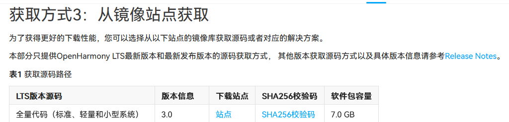

1. 设备开发文档

    https://docs.openharmony.cn/pages/v4.1/zh-cn/device-dev/device-dev-guide.md

    * HPM Part介绍

        https://docs.openharmony.cn/pages/v4.1/zh-cn/device-dev/hpm-part/hpm-part-about.md

        `.json` ：元数据声明文件

    * 获取源码

        https://docs.openharmony.cn/pages/v4.1/zh-cn/device-dev/get-code/sourcecode-acquire.md#openharmony%E4%BB%8B%E7%BB%8D

        

        `repo` 操作：https://blog.csdn.net/knowledgebao/article/details/136380332?ops_request_misc=&request_id=&biz_id=102&utm_term=repo&utm_medium=distribute.pc_search_result.none-task-blog-2~all~sobaiduweb~default-0-136380332.142^v100^pc_search_result_base5&spm=1018.2226.3001.4187

    * 搭建环境

        https://blog.csdn.net/m0_70885101/article/details/137694608

    * FinalShell连接Ubantu

        https://blog.csdn.net/2301_76631937/article/details/138196888

        https://zhuanlan.zhihu.com/p/659748343

    * `Docker` 开发环境准备

