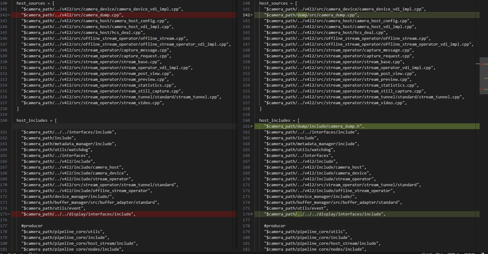
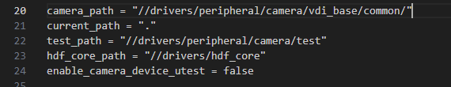

# tar 解压报错

`tar -zxvf link?target=https:%2F%2Frepo.huaweicloud.com%2Fopenharmony%2Fos%2F4.1-Release%2Fdayu200_standard_arm32.tar.gz`

由于压缩文件名中有冒号":"，它会被识别成一个地址而出现报错。此时需要使用 `–force-loca` 的参数来忽略冒号。

`tar -zxvf link?target=https:%2F%2Frepo.huaweicloud.com%2Fopenharmony%2Fos%2F4.1-Release%2Fdayu200_standard_arm32.tar.gz --force-local`

# 常用命令

1. tab 键自动补全

    在敲出命令的前几个字母的同时，按下 tab 键，系统会自动帮我们补全命令

2. history 游览历史

    当系统执行过一些命令后，可按 上下键 翻看以前的命令，history 将执行过的命令列举出来

    history保留了最近执行的命令记录，默认可以保留1000。
    历史清单从0开始编号到最大值。

    常见用法：
    ```
    history N		显示最近N条命令
    history -c		清除所有的历史记录
    history -w  xxx.txt	保存历史记录到文本xxx.txt
    ```

3. 命令行中的ctrl组合键

    ```
    Ctrl + c 结束正在运行的程序

    Ctrl + d 结束输入或退出shell

    Ctrl + s 暂停屏幕输出【锁住终端】

    Ctrl + q 恢复屏幕输出【解锁终端】

    Ctrl + l 清屏，【是字母L的小写】等同于Clear

    ctrl + a ：当前光标到行首

    ctrl + e ：当前光标到行尾

    ctrl + u ：删除当前光标到行首

    ctrl + k ：删除当前光标到行尾

    Ctrl + y 在光标处粘贴剪切的内容

    Ctrl + r 查找历史命令【输入关键字，就能调出以前执行过的命令】

    Ctrl + t 调换光标所在处与其之前字符位置，并把光标移到下个字符

    Ctrl + x + u 撤销操作

    Ctrl + z 转入后台运行
    ```


# DeviceHost 和 PnPManager

USB（UniversalSerialBus），即“通用串行总线”，也称通用串联接口。

Host 就是主，起到控制作用；Device(slave)就是从，是被控制的。例如主机的 USB 口，可以识别 U 盘或者是其它 USB 设备，所以主机的 USB 就是 Host 接口，而 U 盘的就是 Device。OTG就是指既可以做 Host 口亦可以做 device 口。

就是说：USB Host是指驱动过后，板子可以连接USB接口连接的器件，读取和装载数据了，类似PC。USB Device是指驱动过后，板子可以当做一个USB移动设备，通过USB连接到电脑上，类似U盘。

pnp管理器向内核和应用程序提供关于设备拔插的通知，是一个线程函数等待设备通知。

# 编译

dayu210的代码可能在编译这一块有些地方不完美。你可以把某些path写死，比如camera_path，board_xxx_path等等，就拿camera来说，你把几个.gni文件里面只要涉及到path的地方都 写死。

### 报错一 (8.3-build.log)

报错：`ninja: error: '../../drivers/peripheral/camera/vdi_base/v4l2/src/camera_dump.cpp', needed by 'obj/drivers/peripheral/camera/vdi_base/v4l2/src/camera_host_vdi_impl_1.0/camera_dump.o', missing and no known rule to make it`

`camera_dump.cpp` 的路径设置错误。在 `/OpenHarmony/device/board/hihope/dayu210/camera/vdi_impl/v4l2/BUILD.gn` 中修改路径，



`/OpenHarmony/drivers/peripheral/camera/camera.gni` 中有 `$camera_path` 的值




https://blog.csdn.net/aa120515692/article/details/133806238

[打补丁问题](https://blog.csdn.net/Blazar/article/details/131215232)

https://laval.csdn.net/6559826d713f7b219982441f.html


