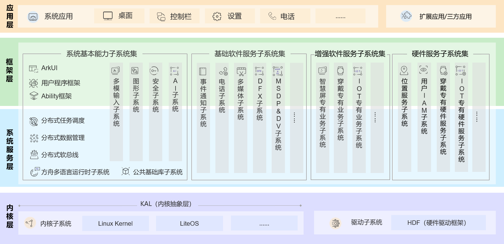

# OpenHarmony 设备开发指导（RK3588）

* [官方文档](https://docs.openharmony.cn/pages/v4.1/zh-cn/device-dev/porting/standard-system-porting-guide.md)

* [各版本源码获取](https://gitee.com/openharmony/docs/blob/master/zh-cn/release-notes/Readme.md)

* [优质学习资源集合](https://gitee.com/isrc_ohos/ultimate-harmony-reference#ultimateharmonyreference)

* [源码解读1](https://gitee.com/weharmony/kernel_liteos_a_note/tree/master)

* [源码解读2](https://my.oschina.net/weharmony?tab=newest&catalogId=7082609&sortType=time)

### OpenHarmony 技术架构



### 项目目的

[消息链接](https://huaweicloud.csdn.net/64df20abd1670e76411026e2.html)

OpenHarmony-v5.0-Beta1 适配公司开发板 RK3588 ，需要完成源码编译到最终烧录镜像到开发板上的任务，项目开发预计需要三个月的时间，在完成既定目标的基础上寻求基于 RK3588 在 Linux 上使用 Docker 运行鸿蒙镜像的完整解决方案。

### 开发流程

1. 硬件准备：首先确保 RK3588 主板与鸿蒙系统的硬件要求兼容（已确定），包括处理器架构、内存、存储和外设接口等方面，同时准备好必要的开发工具、调试器和测试设备。

2. 驱动程序开发：根据 RK3588 的硬件特性，开发相应的设备驱动程序，以便鸿蒙系统能够正确识别和控制硬件，这包括处理器驱动、内存驱动、外设驱动等，确保驱动程序与鸿蒙系统的内核版本和 API 接口兼容。

3. 系统移植和定制：根据 RK3588 的硬件特性和鸿蒙系统的要求，进行系统的移植和定制工作，这可能包括内核的修改、配置和编译，以及必要的文件系统和用户空间工具的调整，确保鸿蒙系统能够在 RK3588 上正常启动和运行。

4. 性能优化：针对 RK3588 的硬件特性，进行必要的性能优化工作，这包括处理器调度、内存管理、图形渲染等方面的优化，以确保系统能够充分发挥 RK3588 的性能优势。

5. 外设支持：确保鸿蒙系统能够正确识别和支持 RK3588 上的各种外设接口，如USB、网络、音频、视频等，并开发相应的外设驱动程序和应用程序接口（API），便于方便地使用这些外设。

6. 电源管理：实现鸿蒙系统在 RK3588 上的电源管理功能，包括休眠、唤醒、功耗控制等方面，开发相应的电源管理驱动程序和配置参数，以确保系统的稳定性和功耗控制。

7. 调试和测试：在适配过程中，进行充分的调试和测试工作，以确保系统的稳定性和兼容性，这包括硬件的调试、软件的测试以及性能测试等方面，使用调试器和测试工具，定位和解决潜在的问题和缺陷。

8. 文档和支持：在适配过程中，编写必要的文档和说明，以方便开发者使用和维护系统。

### 既定开发学习顺序

1. 整体了解：首先了解 [OpenHarmony开源项目](https://docs.openharmony.cn/pages/v4.1/zh-cn/OpenHarmony-Overview_zh.md) ，对项目内容有一个整体的认知。主要涉及 [设备开发文档](https://docs.openharmony.cn/pages/v4.1/zh-cn/device-dev/device-dev-guide.md) ，先从概述中了解整一个开发流程。

2. 搭建开发环境：[获取源码方式](https://gitee.com/openharmony/docs/blob/master/zh-cn/device-dev/get-code/sourcecode-acquire.md) ，也可以进入 [源码仓库](https://gitee.com/openharmony/docs/blob/master/zh-cn/release-notes/Readme.md) 对各个版本进行直接获取。由于需要适配一个新的开发板，官方现有的 IDE 中并没有更新相关资源，所以需要自行修改源码并进行编译，了解 Docker ，在已搭建好的 Docker 镜像中进行源码编译（无需再在本地上自行搭建编译环境），[Docker编译环境指南](https://docs.openharmony.cn/pages/v4.1/zh-cn/device-dev/get-code/gettools-acquire.md) 。

3. 移植指南：通过 [移植指南及标准系统移植案例](https://docs.openharmony.cn/pages/v4.1/zh-cn/device-dev/porting/standard-system-porting-guide.md) 了解整个移植任务的大致流程。

4. 子系统开发：了解基本的 [子系统开发](https://docs.openharmony.cn/pages/v4.1/zh-cn/device-dev/kernel/kernel-overview.md) ，其包括基本的内核、编译构建、启动恢复、驱动子系统开发等。

5. 设备开发示例：通过具体的 [设备开发示例](https://docs.openharmony.cn/pages/v4.1/zh-cn/device-dev/guide/device-driver-demo.md) ，熟悉设备开发。

6. 烧录：通过相关文档和示例，实现 RK3588 的镜像烧录。


### 阶段需求及问题

1. OpenHarmony-v5.0-Beta 及 OpenHarmony-v4.1-Release 编译 dayu210 均出现报错。

    ```
    ninja: error: '../../drivers/peripheral/camera/vdi_base/v4l2/src/camera_dump.cpp', needed by 'obj/drivers/peripheral/camera/vdi_base/v4l2/src/camera_host_vdi_impl_1.0/camera_dump.o', missing and no known rule to make it
    ```

2. 熟悉内核子系统、编译构建子系统、启动恢复子系统、驱动子系统开发。
