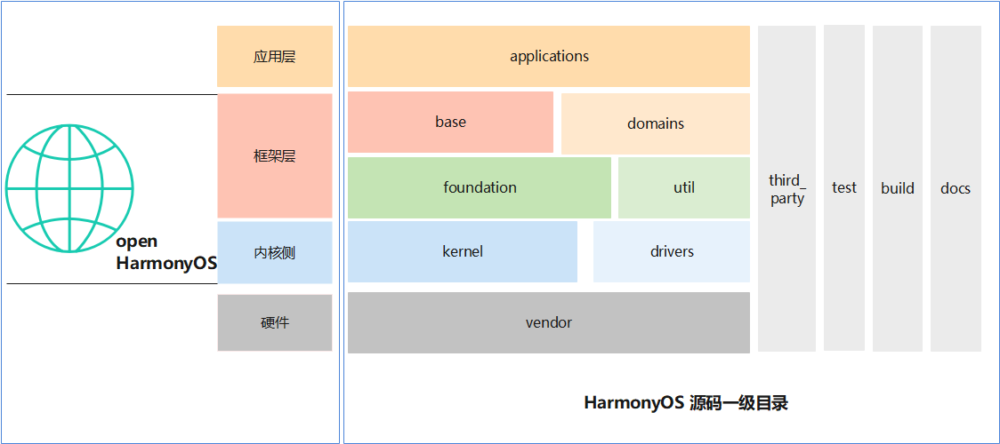
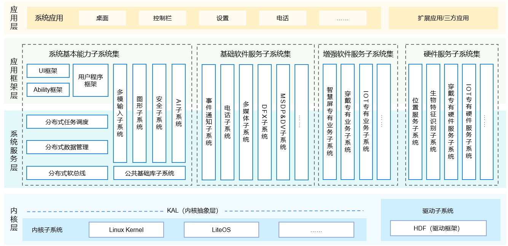

### HarmonyOS源码目录结构的理解


​下图将HarmonyOS源码的一级目录通过软件层进行了简单区分，可以结合HarmonyOS架构图从整体认识HarmonyOS目录结构。





​HarmonyOS架构图中表述的应用框架层和系统服务层，都可以理解为Framework层，是Harmony最重要，也是最核心的部分。

###      applications

​主要存放用户的应用程序，或是 HarmonyOS 预置的系统应用程序。

	applications
	    |
	    |——sample                  //提供Hi3516/Hi3518/Hi3861基础应用，这些应用预置设备中
	        |
	        |——camera			   // 主要说明Hi35xx AI Camera的基础应用
	        |   |
	        |   |——app             // 此目录为用户自己开发的目录，可以通过该目录下的BUILD.gn文件适配是否要预置到系统中
	        |   |——communication   // 通话模块（hostapd wpa_cli wpa_supplicant）
	        |   |——example         // 示例模块
	        |   |——hap             // 预置的app,HarmonyOS 中的hap对应Android中的app
	        |   |——media           // 视频模块实例
	        |——wifi-iot
	            |
	             ——app             // 此目录为用户自己开发的目录，可以通过该目录下的BUILD.gn文件适配是否
									  要预置到系统中(建议IoT开发预置led_example,便于开箱检查产品)
对应的代码仓包含有：

applications/sample/camera: https://gitee.com/openharmony/applications_sample_camera

applications/sample/wifi-iot: https://gitee.com/openharmony/applications_sample_wifi_iot/


###      base

​	    HarmonyOS Framework基础能力集合，定位于大多数设备开发都需要能力模块，目前提供了全球化、DFX、安全、系统启动等模块

	base
	   |
	   |——global                   // 全球化模块，作为设备的基础能力模块，当然也可裁剪掉
		|	|
		|   |——frameworks          // 全球化资源调度模块
		|	|——interfaces          // 全球化资源调度系统间开放APIs
		|——hiviewdfx                // DFX模块
		|	|
		|	|——frameworks
		|	|	|
		|	|	|——ddrdump_lite    // 轻量级设备 Dump信息存储模块，目前暂时没有内容
		|	|	|——hievent_lite    // 轻量级设备DFX-MCU/CPU事件记录模块
		|	|	|——hilog_lite      // 轻量级设备DFX-MCU/CPU日志模块
		|	|——interfaces
		|	|	|
		|	|	|——innerkits       // DFX模块（日志、事件）内部接口
		|	|	|——kits            // DFX模块（日志、事件）APIs
		|	|——services            // DFX-MUC框架/日志服务功能模块Services
		|	|——utils               // DFX-MCU基础组件
		|——iot_hardware             // IoT外设能力模块（GPIO/I2C/SPI/AD/DA等）
		|	|
		|	|——frameworks
		|	|	|
		|	|	 ——wifiiot_lite    // IoT外设模块实现(包含.c文件)
		|	|——hals
		|	|	|
		|	|	 ——wifiiot_lite    // HAL adapter 接口（为frameworks与驱动层提供适配）
		|	|——interfaces
		|		|
		|		 ——kits            // IoT外设控制模块接口,与frameworks/wifiiot_lite配合
		|——security
		|	|
		|	|——frameworks
		|	|	|
		|	|	|——app_verify      // hap包签名校验模块
		|	|	|——crypto_lite     // 加解密模块
		|	|	|——hichainsdk_lite // 设备认证模块
		|	|	|——huks_lite       // 秘钥与证书管理模块
		|	|	|——secure_os       // libteec库函数实现,提供TEE Client APIs
		|	|——interfaces
		|	|	|
		|	|	|——innerkits       // 内部接口目录，与frameworks对应
		|	|	|——kits            // 模块APIs(应用权限管理)   
		|	|——services
		|		|
		|		|——iam_lite        // 应用权限管理及IPC通信鉴权服务
		|		|——secure_os       // secure_os TEE代理服务
		|——startup
			|
			|——frameworks
			|	|
			|	 ——syspara_lite    // 系统属性模块源文件(param_impl_hal-Cortex-M,param_impl_posix-Cortex-A)
			|——hals
			|	|
			|	 ——syspara_lite    // 系统属性模块文文件
			|——interfaces
			|	|
			|	 ——kits            // 系统属性模块对外APIs
			|——services
				|
				|——appspawn_lite   // 应用孵化模块
				|——bootstrap_lite  // 启动服务模块
	            |——init_lite       // 启动引导模块 

interfaces提供内外部APIs

frameworks提供接口实现的源代码；

hals:HAL adapter 接口（为frameworks与驱动层提供适配）

services:通过服务管理模块

​    

### Foundtion

​		Foundtion的中文意义为基础、底座等，这里的基础与Base目录的基础怎么区分，有什么不同呢。下表为HarmonyOS官方帮助资料中的描述。

| 目录名     | 描述                                  |
| ---------- | ------------------------------------- |
| foundation | 系统基础能力子系统集                  |
| base       | 基础软件服务子系统集&硬件服务子系统集 |

​		个人理解Foundtion提供了更为高级的能力模块，此类模块也是HarmonyOS 的核心竞争力模块，例如分布式调度、分布式通信等等。Base和Foundtion之间没有绝对的界限，因为对于低端设备部分Base能力可以也要裁剪，例如:IoT设备中可能不需要全球化；对于高端设备Base和Foundtion的模块都属于基础能力。

```

foundation
	|
	|——aafwk                   // Ability开发框架接口、Ability管理服务
	|	|——frameworks
	|	|	|——ability_lite    // Ability开发框架的源代码
	|	|	|——abilitymgr_lite // 管理AbilityKit与Ability管理服务通信的客户端代码
	|	|	|——want_lite       // Ability之间交互的信息载体的实现代码
	|	|——interfaces
	|	|	|——innerkits	   //Ability管理服务为其它子系统提供的接口
	|	|	|——kits
	|	|	|	|——ability_lite// AbilityKit为开发者提供的接口
	|	|	|	|——want_lite   // Ability之间交互的信息载体的对外接口
	|	|——services		       // Ability管理服务
	|——ace                     // JS应用开发框架，提供了一套跨平台的类web应用开发框架
	|	|——frameworks
	|	|	|——lite
	|	|		|——examples	   // 示例代码目录
	|	|		|——include 	   // 对外暴露头文件存放目录
	|	|		|——packages    // 框架JS实现存放目录
	|	|		|——src         // 源代码存放目录
	|	|		|——targets     // 各目标设备配置文件存放目录
	|	|		|——tools 	   // 工具代码存放目录
	|	|——interfaces          // JS应用框架APIs
	|		|——builtin
	|			|——async       // JS应用框架异步接口
	|			|——base        // 内存管理接口
	|			|——jsi         // JS应用框架对外APIs
	|——appexecfwk
	|	|——frameworks          // 管理BundleKit与包管理服务通信的客户端代码
	|	|——interfaces          // BundleKit为开发者提供的接口
	|	|——services			   // 包管理服务的实现代码
	|	|——utils               // 包管理服务实现中用到的工具性的代码
	|——communication		   // 分布式通信（https://gitee.com/openharmony/docs/blob/master/readme/%E5%88%86%E5%B8%83%E5%BC%8F%E9%80%9A%E4%BF%A1%E5%AD%90%E7%B3%BB%E7%BB%9FREADME.md）
	|	|——frameworks		   
	|	|	|——ipc_lite        // 进程间通信框架实现
	|	|	|——wifi_lite       // Wifi通信框架（未实现）
	|	|——hals                // hal适配层
	|	|——interfaces		   // 提供APIs
	|	|	|——kits
	|	|		|——ipc_lite    // 进程间通信APIs
	|	|		|——softbus_lite// 软总线APIs	
	|	|		|——wifi_lite   // Wi-Fi通信APIs
	|	|——services
	|		|——authmanager     // 提供设备认证机制和设备知识库管理
	|		|——discovery       // 提供基于coap协议的设备发现机制
	|		|——os_adapter	   // OS适配管理
	|		|——trans_service   // 提供认证和传输通道
	|
	|——distributedschedule     // 分布式调度
	|	|——interfaces
	|	|	|——kits
	|	|	|	|——samgr_lite
	|	|	|		|——samgr   // M核和A核系统服务框架APIs
	|	|	|		|——registry 
	|	|   |       |          //A核进程间服务调用APIs
	|	|	|		|——communication 
    |   |   |       |          // M核和A核进程内事件广播服务APIS		
	|	|	|——innerkits       // 内部APIs
	|	|——services
	|		|——dtbschedmgr_lite
	|		|				   // 分布式调度服务管理
	|		|——safwk_lite      // 用于samgr启动，初始化已经注册的Services
	|		|——samgr_lite
	|			|——communication
	|			|			   // M核和A核进程内事件广播服务
	|			|——samgr       
	|			|	|——adapter // POSIX和CMSIS接口适配层,适配屏蔽A核M核接口差异
	|			|——samgr_client// A核进程间服务调用的注册与发现
	|			|——samgr_endpoint
	|			|              // A核IPC通信消息收发包管理
	|			|——samgr_server// A核进程间服务调用的IPC地址管理和访问控制
	|——graphic                 // 图像模块
	|	|
	|	|——frameworks          // 图像目录框架实现
	|	|	|——surface         // Surface共享内存
	|	|	|——ui              // UI模块(UI控件、动画、字体以及DFX等)
	|	|——hals                // hal适配层
	|	|——interfaces
	|	|	|——ui              // UI模块对外接口
	|	|	|——utils           // 图形子系统公共库
	|	|——services
	|	|	|——ims             // 输入管理服务(输入事件处理、分发)
	|	|	|——wms             // 窗口管理服务(窗口的创建、管理和合成)
	|	|——utils               // 图形子系统公共库
	|——multimedia              // 多媒体
		|
		|——frameworks          // 内部框架实现,包括audio,camera,player.recorder
		|——interfaces          // 多媒体APIs
		|——services            // 多媒体接口底层服务实现与管理
		|——utils               // 多媒体接口公共模块实现
		|——hals                // 多媒体HAL adapter,为驱动或硬件提供接口，适配framework	
```

### 	utils

​		公共基础库存放OpenHarmony通用的基础组件。这些基础组件可被OpenHarmony各业务子系统及上层应用所使用。

​		公共基础库在不同平台上提供的能力：

- LiteOS-M内核(Hi3861平台)：KV存储、文件操作、定时器、IoT外设控制

- LiteOS-A内核(Hi3516、Hi3518平台)：KV存储、定时器、ACE JS API

  ```
  utils
  	|——native
  		|——lite
  			|——file         // 文件APIs实现
  			|——hals         // hals(适配文件操作硬件抽象层)
  			|——include      // 公共基础库头文件
  			|——js			// ACE JS APIs
  			|——kal          // KAL  timer
  			|——kv_store		// KV存储实现
  			|——timer_task  	// Timer实现
  ```

  至此，完成应用框架目录的梳理，接着梳理内核层的目录。


### kernel

kernel目录目前包含了Liteos-a/Liteos-m，随着发展也许harmonyOS会支持类Linux的重量级设备。当前的内核主要面向IoT领域，包括了线程、进程、内存管理等基本功能。

| 名称     | 描述                                                   |
| -------- | ------------------------------------------------------ |
| apps     | 用户态的init和shell应用程序。                          |
| arch     | 体系架构的目录，如arm等。                              |
| bsd      | freebsd相关的驱动和适配层模块代码引入，例如USB等。     |
| compat   | 内核posix接口的兼容。                                  |
| fs       | 文件系统模块，主要来源于NuttX开源项目。                |
| kernel   | 进程、内存、IPC等模块。                                |
| lib      | 内核的lib库。                                          |
| net      | 网络模块，主要来源于lwip开源项目。                     |
| platform | 支持不同的芯片平台代码，如Hi3516DV300等。              |
| security | 安全特性相关的代码，包括进程权限管理和虚拟id映射管理。 |
| syscall  | 系统调用。                                             |
| tools    | 构建工具及相关配置和代码。                             |

参考：

https://gitee.com/openharmony/docs/blob/master/readme/%E5%86%85%E6%A0%B8%E5%AD%90%E7%B3%BB%E7%BB%9FREADME.md

内核实用指导：https://gitee.com/openharmony/docs/blob/master/kernel/Readme-CN.md

### drivers

驱动，就是一个完成软件与硬件通信程序的。harmony旨在通过平台解耦、内核解耦，兼容不同内核，提供了归一化的驱动平台底座，为开发者提供更精准、更高效的开发环境，力求做到一次开发，多系统部署。

驱动代码的目录结构如下：

```
driver
	|——HDF					// harmonyOS 驱动框架
	|	|——frameworks       // 完成驱动框架、模型、能力库的实现
	|	|	|——ability		// 提供驱动开发的功能能力支持，如消息模型库等
	|	|	|——core			// HDF（harmonyOS 驱动框架）核心代码
	|	|	|	|——host		// 驱动宿主环境框架功能
	|	|	|	|——manger   // 框架管理模块
	|	|	|	|——shared   // host和manager共享模块代码
	|	|	|——include		// HDF相关接口的头文件
	|	|	|——model		// 驱动通用框架模型
	|	|	|——support      // 驱动使用的系统接口资源和硬件资源(已经进行平台解耦)，即platformDriver
	|	|	|——tools        // 驱动能力工具库（hc-gen）
	|	|	|——utils		// 驱动相关基础数据结构和算法等
	|	|——lite
	|		|——adapter      // 实现对内核操作接口适配
	|		|——hdi          // 驱动程序接口
	|		|——include		// 轻量设备的HDF头文件
	|		|——manager		// 驱动设备管理
	|		|——model        // 轻量设备的驱动模型
	|		|——posix        // 轻量设备与系统相关的接口适配
	|		|——tools        // 驱动能力工具库
	|——liteos
		|——hievent          // Liteos事件驱动
		|——include
		|——mem				// Liteos内存管理驱动
		|——random           // Liteos 随机数驱动
		|——tzdriver         // TrustZone驱动
		|——video			// video驱动
```

