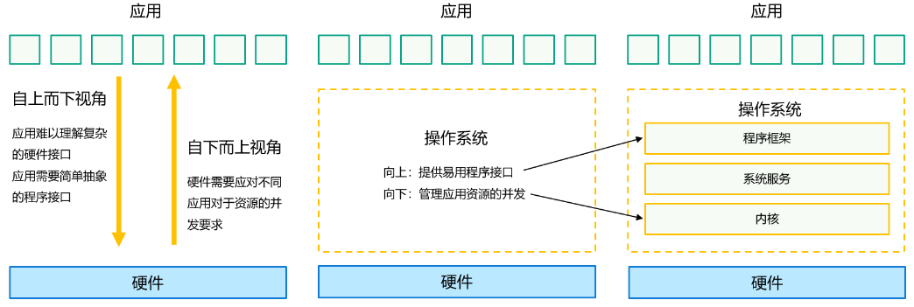
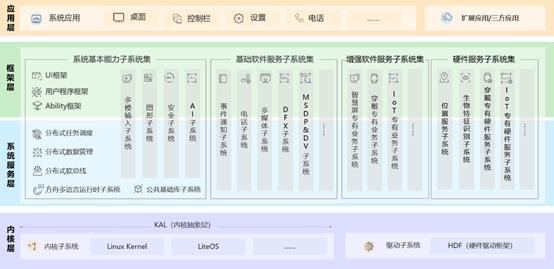
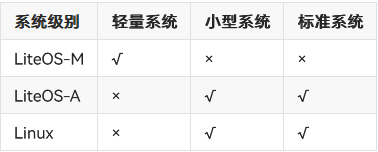
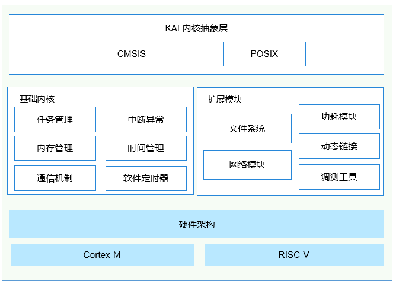
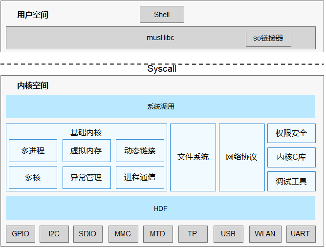

# 内核概述

### 内核简介

操作系统最重要的核心功能包括管理硬件设备，分配系统资源等，实现这些核心功能的操作系统模块称为操作系统 “*内核* ”。

### 实现原理

操作系统是位于应用和硬件之间的系统软件，向上提供易用的程序接口和运行环境，向下管理硬件资源。内核位于操作系统的下层，为操作系统上层的程序框架提供硬件资源的并发管理。

### 多内核架构和基本组成

每个内核均要具备的最重要的组成单元:

* “文件系统”：负责持久化数据，并让应用程序能够方便的访问持久化数据。

* “内存管理”：负责管理进程地址空间。

* “任务（进程）管理”：负责管理多个进程。

* “网络”：负责本机操作系统和另外一个设备上操作系统通信。

OpenHarmony采用了多内核结构，支持Linux和LiteOS，开发者可按不同产品规格进行选择使用。Linux和LiteOS均具备上述组成单元，只是实现方式有所不同。多个内核通过KAL（Kernel Abstraction Layer）模块，向上提供统一的标准接口。

内核子系统位于OpenHarmony下层。需要特别注意的是，由于OpenHarmony面向多种设备类型，这些设备有着不同的CPU能力，存储大小等。为了更好的适配这些不同的设备类型，内核子系统支持针对不同资源等级的设备选用适合的OS内核，内核抽象层（KAL，Kernel Abstract Layer）通过屏蔽内核间差异，对上层提供基础的内核能力。

### 不同内核适配的系统及设备类型

OpenHarmony按照支持的设备可分为如下几种系统类型：

* 轻量系统（mini system） 面向MCU类处理器例如Arm Cortex-M、RISC-V 32位的设备，硬件资源极其有限，支持的设备最小内存为128KiB，可以提供多种轻量级网络协议，轻量级的图形框架，以及丰富的IOT总线读写部件等。可支撑的产品如智能家居领域的连接类模组、传感器设备、穿戴类设备等。

* 小型系统（small system） 面向应用处理器例如Arm Cortex-A的设备，支持的设备最小内存为1MiB，可以提供更高的安全能力、标准的图形框架、视频编解码的多媒体能力。可支撑的产品如智能家居领域的IP Camera、电子猫眼、路由器以及智慧出行域的行车记录仪等。

* 标准系统（standard system） 面向应用处理器例如Arm Cortex-A的设备，支持的设备最小内存为128MiB，可以提供增强的交互能力、3D GPU以及硬件合成能力、更多控件以及动效更丰富的图形能力、完整的应用框架。可支撑的产品如高端的冰箱显示屏。

OpenHarmony针对不同量级的系统，使用了不同形态的内核。轻量系统、小型系统可以选用LiteOS；小型系统和标准系统可以选用Linux。其对应关系如下表：

# LiteOS-M

OpenHarmony LiteOS-M 内核是面向 IoT（物联网）领域构建的轻量级物联网操作系统内核，具有小体积、低功耗、高性能的特点，其代码结构简单，主要包括内核最小功能集、内核抽象层、可选组件以及工程目录等，分为硬件相关层以及硬件无关层，硬件相关层提供统一的HAL（Hardware Abstraction Layer）接口，提升硬件易适配性，不同编译工具链和芯片架构的组合分类，满足AIoT（智能物联网）类型丰富的硬件和编译工具链的拓展。

# LiteOS-A

轻量级内核 LiteOS-A 重要的新特性如下：

* 新增了丰富的内核机制：

    * 新增虚拟内存、系统调用、多核、轻量级IPC（Inter-Process Communication，进程间通信）、DAC（Discretionary Access Control，自主访问控制）等机制，丰富了内核能力；

    * 为了更好的兼容软件和开发者体验，新增支持多进程，使得应用之间内存隔离、相互不影响，提升系统的健壮性。

* 引入统一驱动框架 HDF（Hardware Driver Foundation）

    引入统一驱动框架 HDF，统一驱动标准，为设备厂商提供了更统一的接入方式，使驱动更加容易移植，力求做到一次开发，多系统部署。

* 支持1200+标准 POSIX 接口

    更加全面的支持POSIX标准接口，使得应用软件易于开发和移植，给应用开发者提供了更友好的开发体验。

* 内核和硬件高解耦

    轻量级内核与硬件高度解耦，新增单板，内核代码不用修改。（解耦的目标是将这种紧密耦合的关系松散化，使得模块之间的改动互不影响或最小化影响）

# Linux

针对不同的芯片，各厂商合入对应的板级驱动补丁，完成对 OpenHarmony 的基线适配。内核的Patch组成模块，在编译构建流程中，针对具体芯片平台，合入对应的架构驱动代码，进行编译对应的内核镜像。

OpenHarmony针对linux内核在ESwap(Enhanced Swap)、关联线程组调度和CPU轻量级隔离做了增强。

Linux内核版本分为稳定版本以及长期支持LTS(long term support)版本。OpenHarmony 中Linux内核从LTS版本中选择合适的版本作为内核的基础版本，目前已完成对Linux-4.19及Linux-5.10的适配及支持。

### OpenHarmony开发板Patch使用指导

### Linux内核编译与构建指导

### 内核增强特性：Enhanced SWAP 特性介绍

### 内核增强特性：New IP 内核协议栈介绍

### 内核增强特性：关联线程组调度特性介绍

### 内核增强特性：CPU 轻量级隔离特性介绍
