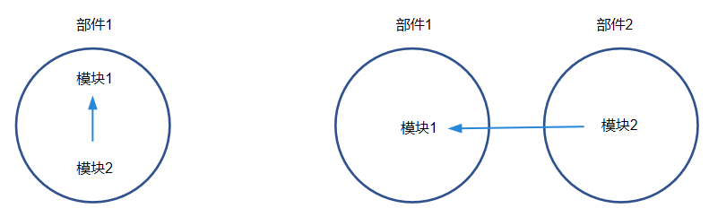

* [关于deps、external_deps的使用](#aaa)
* [加快本地编译的一些参数](#bbb)


# 关于deps、external_deps的使用<a id="aaa"></a>

在添加一个模块的时候，需要在 BUILD.gn 中声明它的依赖，为了便于后续处理部件间依赖关系，我们将依赖分为两种——部件内依赖 deps 和部件间依赖 external_deps 。



- 部件内依赖示例：

    ```shell
    import("//build/ohos.gni")
    ohos_shared_library("module1") {
    ……
    part_name = "part1"   # 必选，所属部件名称
    ……
    }
    ```

    ```shell
    import("//build/ohos.gni")
    ohos_shared_library("module2") {
    ……
    deps = [
        "module1的gn target",
    ……
    ]                        # 部件内模块依赖
    part_name = "part1"       # 必选，所属部件名称
    }
    ```

- 部件间依赖示例：

    ```shell
    import("//build/ohos.gni")
    ohos_shared_library("module1") {
    ……
    part_name = "part1"   # 必选，所属部件名称
    ……
    }
    ```

    ```shell
    import("//build/ohos.gni")
    ohos_shared_library("module2") {
    ……
    external_deps = [
        "part1:module1",
    ……
    ]                      # 部件间模块依赖，这里依赖的模块必须是依赖的部件声明在inner_kits中的模块
    part_name = "part2"    # 必选，所属部件名称
    }
    ```

# 加快本地编译的一些参数<a id="bbb"></a>

编译时，适当选择添加以下的编译参数可以加快编译的过程。    

1. 添加 –ccache 参数:

    原理：ccache 会缓存 c/c++ 编译的编译输出，下一次在编译输入不变的情况下，直接复用缓存的产物。

    使用：执行 `./build.sh --product-name {产品名} --ccache` 。

2. 添加 –fast-rebuild 参数

    原理：编译流程主要分为：preloader->loader->gn->ninja 这四个过程，在本地没有修改 gn 和产品配置相关文件的前提下，添加 –fast-rebuild 会让你直接从 ninja 编译开始。

    使用：执行 `./build.sh --product-name {产品名} --fast-rebuild` 。

3. 添加 -enable_notice_collection=false 参数

    原理：省略掉收集开源软件模块的 license 的过程。

    使用：执行 `./build.sh --product-name {产品名} --gn-args --enable_notice_collection=false --ccache` 。

4. 添加 –build-target 参数

    该参数用于指定编译模块，如何找模块的名字：

    - 相关仓下 BUILD.gn 中关注 group、ohos_shared_library、ohos_executable 等关键字。
    - ./build.sh --product-name 产品名 --build-target 模块名 --build-only-gn生成build.ninja，然后去该文件中查找相关模块名。

    使用：执行 `./build.sh --product-name {产品名} --build-target ark_js_host_linux_tools_packages` 。


