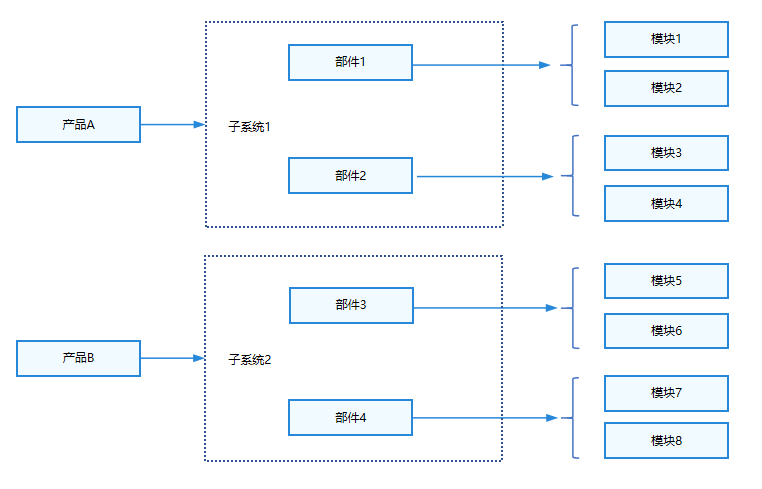
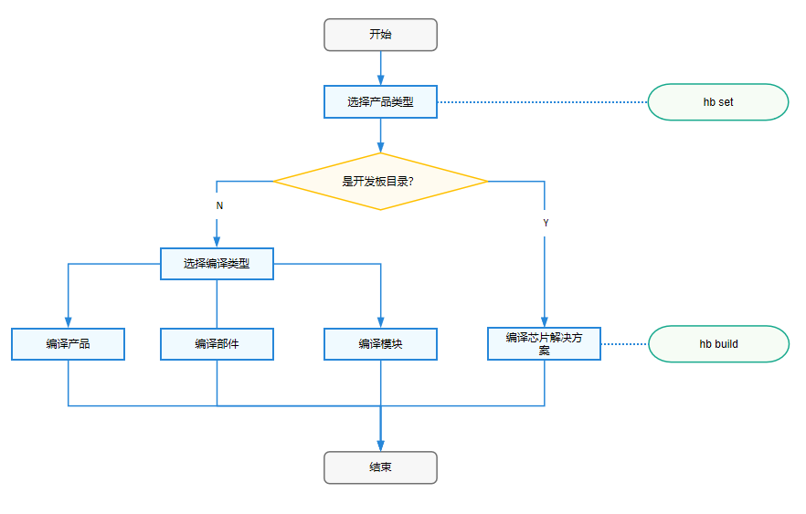

# 编译构建指导

OpenHarmony 编译子系统以 GN 和 Ninja 构建为基础，编译子系统通过配置来实现编译和打包，该子系统主要包括：模块、部件、子系统、产品。如下是一些基本概念：


* 平台：开发板和内核的组合，不同平台支持的子系统和部件不同。
* 产品：产品是包含一系列部件的集合，编译后产品的镜像包可以运行在不同的开发板上。
* 子系统：OpenHarmony 整体遵从分层设计，从下向上依次为：内核层、系统服务层、框架层和应用层（详见 OpenHarmony 技术架构）。系统功能按照“系统 > 子系统 > 部件”逐级展开，在多设备部署场景下，支持根据实际需求裁剪某些非必要的子系统或部件。子系统是一个逻辑概念，它具体由对应的部件构成。
* 部件：对子系统的进一步拆分，可复用的软件单元，它包含源码、配置文件、资源文件和编译脚本；能独立构建，以二进制方式集成，具备独立验证能力的二进制单元。需要注意的是下文中的芯片解决方案本质是一种特殊的部件。
* 模块：模块就是编译子系统的一个编译目标，部件也可以是编译目标。
* 特性：特性是部件用于体现不同产品之间的差异。
* GN：Generate Ninja 的缩写，用于产生 Ninja 文件。
* Ninja：Ninja 是一个专注于速度的小型构建系统。
* hb：OpenHarmony 的命令行工具，用来执行编译命令。



* 子系统是某个路径下所有部件的集合，一个部件只能属于一个子系统。
* 部件是模块的集合，一个模块只能归属于一个部件。
* 通过产品配置文件配置一个产品包含的部件列表，部件不同的产品配置可以复用。
* 部件可以在不同的产品中实现有差异，通过变体或者特性feature实现。
* 模块就是编译子系统的一个编译目标，部件也可以是编译目标。

编译构建可以编译产品、部件和模块，但是不能编译子系统。编译构建流程如下图所示，主要分设置和编译两步：




1. 读取编译配置：根据产品选择的开发板，读取开发板 `config.gni` 文件内容，主要包括编译工具链、编译链接命令和选项等。
2. 调用GN：调用 `gn gen` 命令，读取产品配置生成产品解决方案 out 目录和 Ninja 文件。
3. 调用Ninja：调用 `ninja -C out/board/product` 启动编译。
4. 系统镜像打包：将部件编译产物打包，设置文件属性和权限，制作文件系统镜像。

当然也可以不使用 OpenHarmony 的编译构建工具 `hb`，可以直接使用编译脚本进行编译 `./build.sh --product-name {product_name} --ccashe`。在此之前，需运行已搭建好编译环境的容器并进入到此容器中，再进行编译，`docker run -it -v $(pwd):/home/openharmony swr.cn-south-1.myhuaweicloud.com/openharmony-docker/docker_oh_standard:3.2`

目录结构：

```
/build                            # 编译构建主目录

├── __pycache__                   
├── build_scripts/                # 编译相关的python脚本
├── common/                       
├── config/                       # 编译相关的配置项
├── core
│   ├── gn/                       # 编译入口BUILD.gn配置
    └── build_scripts/            
├── docs                          
gn_helpers.py*                    
lite/                             # hb和preloader入口                      
misc/
├── ohos                          # OpenHarmony编译打包流程配置
│   ├── kits                      # kits编译打包模板和处理流程
│   ├── ndk                       # ndk模板和处理流程
│   ├── notice                    # notice模板和处理流程
│   ├── packages                  # 版本打包模板和处理流程
│   ├── sa_profile                # sa模板和处理流程
│   ├── sdk                       # sdk模板和处理流程，包括sdk中包含的模块配置
│   └── testfwk                   # 测试相关的处理
├── ohos.gni*                     # 汇总了常用的gni文件，方便各个模块一次性import
├── ohos_system.prop              
├── ohos_var.gni*                 
├── prebuilts_download.sh*        
├── print_python_deps.py*         
├── scripts/                      
├── subsystem_config.json         
├── subsystem_config_example.json 
├── templates/                    # c/c++编译模板定义
├── test.gni*                     
├── toolchain                     # 编译工具链配置
├── tools                         # 常用工具
├── version.gni                   
├── zip.py*                       
```
