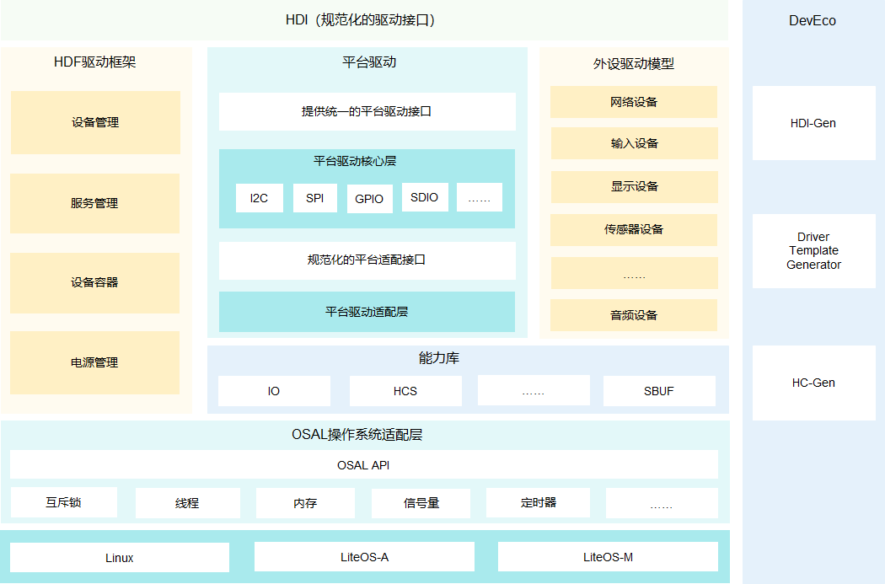
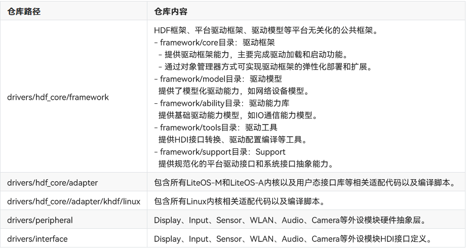

# 概述

### 简介

当相同的硬件部署不同内核时，如何能够让设备驱动程序在不同内核间平滑迁移，消除驱动代码移植适配和维护的负担，是 OpenHarmony 驱动子系统需要解决的重要问题。

OpenHarmony 驱动子系统支持以下关键特性和能力。

* 弹性化的框架能力

    在传统的驱动框架能力的基础上，OpenHarmony 驱动子系统通过构建弹性化的框架能力，可支持在百K级别到百兆级容量的终端产品形态部署。

* 规范化的驱动接口

    定义了常见驱动接口，为驱动开发者和使用者提供丰富、稳定接口，并和未来开放的面向手机、平板、智慧屏等设备驱动接口保持 API 兼容性。

* 组件化的驱动模型

    支持组件化的驱动模型，为开发者提供更精细化的驱动管理，开发者可以对驱动进行组件化拆分，使得驱动开发者可以更多关注驱动与硬件交互部分。同时系统也预置了部分模板化的驱动模型组件，如网络设备模型等。

* 归一化的配置界面

    提供统一的配置界面，构建跨平台的配置转换和生成工具，实现跨平台的无缝切换。

### 驱动架构

HDF（Hardware Driver Foundation）驱动框架，为驱动开发者提供驱动框架能力，包括驱动加载、驱动服务管理和驱动消息机制，力求做到一次开发，多系统部署。

HDF 驱动架构采用C语言面向对象编程模型构建，通过平台解耦、内核解耦，来达到兼容不同内核、统一平台底座的目的。

HDF驱动架构主要组成部分：

* HDI（Hardware Device Interface，硬件设备统一接口）层：通过规范化的设备接口标准，为系统提供统一、稳定的硬件设备操作接口。

* HDF 驱动框架：提供统一的硬件资源管理、驱动加载管理、设备节点管理、设备电源管理以及驱动服务模型等功能，需要包含设备管理、服务管理、DeviceHost、PnPManager等模块。

* 统一的配置界面：支持硬件资源的抽象描述，屏蔽硬件差异，可以支撑开发者开发出与配置信息不绑定的通用驱动代码，提升开发及迁移效率，并可通过 HC-Gen 等工具快捷生成配置文件。

* 操作系统抽象层（OSAL，Operating System Abstraction Layer）：提供统一封装的内核操作相关接口，屏蔽不同系统操作差异，包含内存、锁、线程、信号量等接口。

* 平台驱动：为外设驱动提供 Board 硬件（如：I2C/SPI/UART总线等平台资源）操作统一接口，同时对 Board 硬件操作进行统一的适配接口抽象以便于不同平台迁移。

* 外设驱动模型：面向外设驱动，提供常见的驱动抽象模型，主要达成两个目的，提供标准化的器件驱动，开发者无需独立开发，通过配置即可完成驱动的部署；提供驱动模型抽象，屏蔽驱动与不同系统组件间的交互，使得驱动更具备通用性。

### 驱动开发

#### 平台驱动

OpenHarmony平台驱动（Platform Driver），即平台设备（Platform Device）驱动，为系统及外设驱动提供访问接口。这里的平台设备，泛指I2C/UART等总线、以及GPIO/RTC等特定硬件资源。平台驱动框架是OpenHarmony驱动框架的重要组成部分，它基于HDF驱动框架、操作系统适配层以及驱动配置管理机制，为各类平台设备驱动的实现提供标准模型。平台驱动框架为外设提供了标准的平台设备访问接口，使其不必关注具体硬件；同时为平台设备驱动提供统一的适配接口，使其只关注自身硬件的控制。

平台驱动框架提供如下特性：

* 统一的平台设备访问接口：对平台设备操作接口进行统一封装，屏蔽不同SoC平台硬件差异以及不同OS形态差异。

* 统一的平台驱动适配接口：为平台设备驱动提供统一的适配接口，使其只关注自身硬件的控制，而不必关注设备管理及公共业务流程。

* 提供设备注册、管理、访问控制等与SoC无关的公共能力。

平台驱动框架目前支持的设备类型包括但不限于：ADC、DAC、GPIO、HDMI、I2C、I3C、MIPI_CSI、MIPI_DSI、MMC、Pin、PWM、Regulator、RTC、SDIO、SPI、UART、WatchDog等。

#### 外设驱动

OpenHarmony在HDF驱动框架及平台驱动框架的基础上，面向外设器件驱动，提供常见的驱动抽象模型。它提供标准化的外设器件驱动，可以减少重复开发；同时提供统一的外设驱动模型抽象，屏蔽驱动与不同系统组件间的交互，使得驱动更具备通用性。

OpenHarmony当前支持的外设设备类型包括但不限于：Audio、Camera、Codec、Face_auth、Fingerprint_auth、LCD、Light、Motion、Pin_auth、Sensor、Touchscreen、USB、User_auth、Vibrator、WLAN等。

#### 驱动代码仓

HDF驱动架构实现根据功能和模块分为多个代码仓。

#### 使用指导

当您需要为新的平台设备适配OpenHarmony驱动时，可使用OpenHarmony平台驱动框架提供的标准模型和统一的适配接口，这样您只需要关注自身硬件的控制，而不必关注设备管理及公共业务流程。平台设备的驱动适配操作，可参考“平台驱动开发”章节。

平台驱动适配完成后，您可以使用OpenHarmony平台驱动框架为系统及外设驱动提供的统一访问接口进行进一步的服务和应用的开发，而不必关注具体硬件及OS平台的差异。平台驱动提供的访问接口的使用方法，可参考“平台驱动使用”章节。

OpenHarmony驱动架构为用户提供了多种标准外设驱动模型。这些模型屏蔽硬件差异，为上层服务提供稳定、标准的接口。您可以基于这些模型进行外设驱动的开发，不同类型的外设采用不同的模型，详细的使用方法可参考“外设驱动使用”章节。

# HDF驱动开发流程

# 平台驱动开发

# 平台驱动使用

# 外设驱动使用
