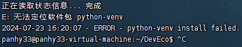

# **RK3588 适配 OpenHarmony**

**项目目标**： 

https://blog.csdn.net/isoftstone_HOS/article/details/128247240?spm=1001.2014.3001.5506

**主要参考**： 

*OpenHarmony开源项目* ：标准系统

https://docs.openharmony.cn/pages/v4.1/zh-cn/OpenHarmony-Overview_zh.md/

**基础环境准备**： 

下载 VMware Station 16 版本（已安装 D:\），配置 Ubuntu 环境（位置：D:\DevEco_Device_Tool\ubuntu-20.04-desktop-amd64.iso） ，内存设置 16GB 及以上，磁盘空间设置 100GB 及以上。下载 FinalShell 并链接到 Ubuntu 的环境。空间需要足够大，不然会发生下载源码或环境配置时空间不够大的灾难，就不得不重新配置 Ubuntu 环境了！而且注意 Ubuntud 的版本号！

https://blog.csdn.net/m0_70885101/article/details/137694608

https://blog.csdn.net/2301_76631937/article/details/138196888

https://zhuanlan.zhihu.com/p/659748343

### 基于命令行开发

1. 准备 Docker 搭建环境，方便编译执行，https://gitee.com/openharmony/docs/blob/master/zh-cn/device-dev/get-code/gettools-acquire.md 

    Docker 介绍：https://blog.csdn.net/liyou123456789/article/details/122292877

### 基于 IDE 开发

1. 在 Windows 和 Ubuntu 系统上安装的 DevEco Device Tool

    https://docs.openharmony.cn/pages/v4.1/zh-cn/device-dev/quick-start/quickstart-ide-env-win.md

    在 Ubuntu 中解压 DevEco 中报错:

    

    解决： 重装 Ubuntu 20.04 系统！！

2. 标准系统（基于 RK3568 开发板）

